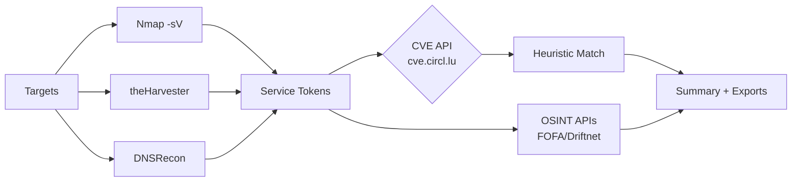
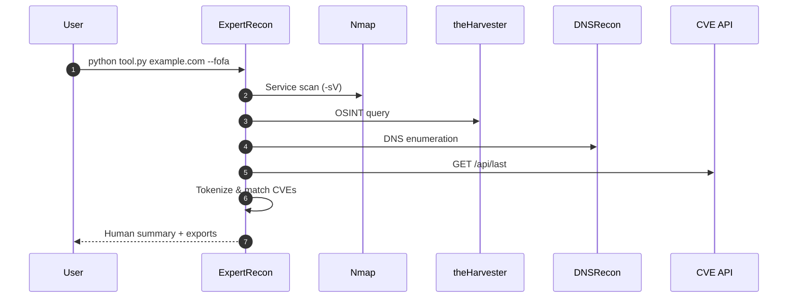
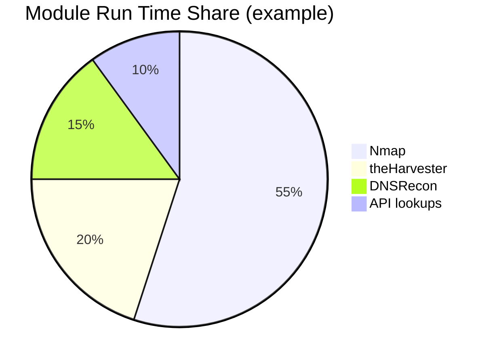

# ExpertRecon

**ExpertRecon** is a powerful reconnaissance and correlation toolkit designed for security professionals and authorized testers. It integrates classic recon tools, optional OSINT APIs, and a fast heuristic CVE correlation to highlight potential risks. Offensive automation is **disabled by default** and gated behind explicit flags and environment checks.

> **Legal & Ethics**: Use **only** on systems where you have explicit permission. You are responsible for complying with all laws and agreements.

---

```text
███████╗██╗  ██╗██████╗ ███████╗██████╗ ████████╗██████╗ ███████╗ ██████╗ ██████╗ ███╗   ██╗
██╔════╝╚██╗██╔╝██╔══██╗██╔════╝██╔══██╗╚══██╔══╝██╔══██╗██╔════╝██╔════╝██╔═══██╗████╗  ██║
█████╗   ╚███╔╝ ██████╔╝█████╗  ██████╔╝   ██║   ██████╔╝█████╗  ██║     ██║   ██║██╔██╗ ██║
██╔══╝   ██╔██╗ ██╔═══╝ ██╔══╝  ██╔══██╗   ██║   ██╔══██╗██╔══╝  ██║     ██║   ██║██║╚██╗██║
███████╗██╔╝ ██╗██║     ███████╗██║  ██║   ██║   ██║  ██║███████╗╚██████╗╚██████╔╝██║ ╚████║
╚══════╝╚═╝  ╚═╝╚═╝     ╚══════╝╚═╝  ╚═╝   ╚═╝   ╚═╝  ╚═╝╚══════╝ ╚═════╝ ╚═════╝ ╚═╝  ╚═══╝

                       v2 by sudo3rs
```

## Table of Contents
- [Features](#features)
- [Architecture (Mermaid)](#architecture-mermaid)
- [Installation](#installation)
  - [Prerequisites](#prerequisites)
  - [Steps](#steps)
- [Configuration](#configuration)
- [Usage](#usage)
  - [Quick Start](#quick-start)
  - [Common Examples](#common-examples)
- [Outputs](#outputs)
- [Troubleshooting](#troubleshooting)
- [Contributing](#contributing)
- [License](#license)
- [Acknowledgments](#acknowledgments)

## Features

- **Target input**: Single IP/domain or a file of targets.
- **Recon modules**:
  - **Nmap**: Service detection (`-sV`) with parsing to extract product/version.
  - **theHarvester**: OSINT collection (Google backend by default).
  - **DNSRecon**: DNS enumeration.
- **OSINT APIs (optional)**:
  - **FOFA**: Host intelligence (requires API key).
  - **Driftnet**: Additional OSINT (requires API key).
- **CVE correlation**: Lightweight heuristic match of discovered service tokens against the latest CVEs (cve.circl.lu).
- **AI summary (optional)**: OpenAI-assisted defensive recommendations.
- **Robustness**: Timeouts, retries, rotating logs, graceful failure.
- **Exports**: Per-target directory with raw outputs, `report.json`, and `cve_matches.csv`.
- **Safety by default**: Offensive automation is gated and off by default.

## Architecture (Mermaid)

### Data Flow


### Sequence (Single Target)


### Example Runtime Split (Illustrative)


## Installation

### Prerequisites

- **Python 3.8+**
- **Nmap** (ensure it's on your PATH)
- **theHarvester** (pip/pipx)
- **DNSRecon** (pip/pipx)
- (Optional) **Metasploit Framework** (for gated stub checks)
- (Optional) **OpenAI API key** for AI summary
- (Optional) **FOFA / Driftnet API keys**

> **Windows tips**:  
> - Install Nmap from https://nmap.org/download and check “Add to PATH”.  
> - Install `theHarvester` and `dnsrecon` with `pipx` or `pip` in a virtualenv.  
> - WSL is supported if you prefer Linux tooling.

### Steps

1. **Clone the repository**
   ```bash
   git clone https://github.com/Masriyan/ExpertRecon.git
   cd ExpertRecon
   ```

2. **Install Python dependencies**
   ```bash
   pip install -r requirements.txt
   ```

3. **Install external tools**
   - **Debian/Ubuntu**
     ```bash
     sudo apt update
     sudo apt install -y nmap
     pipx install theHarvester
     pipx install dnsrecon
     # (optional) Metasploit: follow vendor instructions
     ```
   - **Windows (PowerShell)**
     ```powershell
     # Nmap: install via official installer, ensure "Add to PATH"
     py -m pip install --upgrade pip
     py -m pip install -r requirements.txt
     py -m pip install pipx
     pipx install theHarvester
     pipx install dnsrecon
     ```

## Configuration

Set API keys via environment variables (recommended):
```bash
# Bash
export FOFA_EMAIL="you@example.com"
export FOFA_API_KEY="your_fofa_key"
export DRIFNET_API_KEY="your_driftnet_key"
export OPENAI_API_KEY="your_openai_key"
# Safety gate (default SAFE_MODE=1)
export SAFE_MODE=1
```

```powershell
# PowerShell
$env:FOFA_EMAIL="you@example.com"
$env:FOFA_API_KEY="your_fofa_key"
$env:DRIFNET_API_KEY="your_driftnet_key"
$env:OPENAI_API_KEY="your_openai_key"
$env:SAFE_MODE="1"
```

You can verify your configuration:
```bash
python tool.py example.com --show-config
```

## Usage

> **Reminder**: Authorized targets only.

### Quick Start
```bash
python tool.py example.com
```

### Common Examples

- Enable FOFA and raise CVE cap:
  ```bash
  python tool.py targets.txt --fofa --cve-limit 400 --debug
  ```

- Custom export directory (Windows path):
  ```powershell
  python tool.py corp.local --export-dir "C:\Temp\recon_exports"
  ```

- Disable specific modules:
  ```bash
  python tool.py example.com --no-harvester --no-dnsrecon
  ```

- Show effective config (keys redacted):
  ```bash
  python tool.py example.com --show-config
  ```

- (Authorized testing only) Gated Metasploit stub:
  ```bash
  # Requires BOTH: SAFE_MODE=0 and AUTH_TEST=YES
  export SAFE_MODE=0
  export AUTH_TEST=YES
  python tool.py authorized.test --allow-offensive --msf-module auxiliary/scanner/portscan/tcp
  ```

## Outputs

Per target, results are saved under `exports/<target>/`:
- `nmap.txt`, `theharvester.txt`, `dnsrecon.txt`
- `fofa.json`, `driftnet.json` (if enabled)
- `cve_matches.csv` — quick view of heuristic CVE matches
- `report.json` — structured run summary
- `ai_summary.txt` — only if `--ai-summary` is used

## Troubleshooting

- **Tool not found**: Ensure `nmap`, `theharvester`, and `dnsrecon` are on your PATH.
- **API errors**: Confirm keys are valid and set as environment variables.
- **No CVE matches**: The matcher is heuristic—treat as hints; manually validate.
- **Windows subprocess issues**: Run terminal as Administrator if PATH changes were recent.
- **Slow scans**: Reduce modules or targets; increase network reliability; consider running during off-hours.

## Contributing

1. Fork the repo
2. Create a branch: `git checkout -b feature/YourFeature`
3. Commit: `git commit -m "feat: add YourFeature"`
4. Push: `git push origin feature/YourFeature`
5. Open a PR

## License

MIT — see [LICENSE](LICENSE).

## Acknowledgments

- [Nmap](https://nmap.org/)
- [theHarvester](https://github.com/laramies/theHarvester)
- [DNSRecon](https://github.com/darkoperator/dnsrecon)
- [Metasploit](https://www.metasploit.com/)
- [OpenAI](https://openai.com/)
- cve.circl.lu API

---

**Additional Files**  
See `requirements.txt` for Python dependencies.
