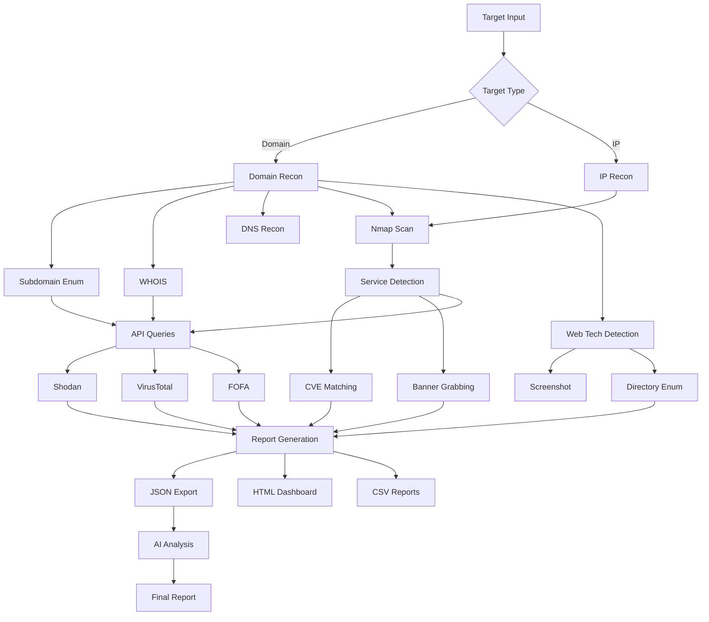

# ExpertRecon v2.0 - Advanced Reconnaissance Toolkit

An enhanced, professional-grade reconnaissance and correlation toolkit for security professionals conducting authorized security assessments.

```text
███████╗██╗  ██╗██████╗ ███████╗██████╗ ████████╗██████╗ ███████╗ ██████╗ ██████╗ ███╗   ██╗
██╔════╝╚██╗██╔╝██╔══██╗██╔════╝██╔══██╗╚══██╔══╝██╔══██╗██╔════╝██╔════╝██╔═══██╗████╗  ██║
█████╗   ╚███╔╝ ██████╔╝█████╗  ██████╔╝   ██║   ██████╔╝█████╗  ██║     ██║   ██║██╔██╗ ██║
██╔══╝   ██╔██╗ ██╔═══╝ ██╔══╝  ██╔══██╗   ██║   ██╔══██╗██╔══╝  ██║     ██║   ██║██║╚██╗██║
███████╗██╔╝ ██╗██║     ███████╗██║  ██║   ██║   ██║  ██║███████╗╚██████╗╚██████╔╝██║ ╚████║
╚══════╝╚═╝  ╚═╝╚═╝     ╚══════╝╚═╝  ╚═╝   ╚═╝   ╚═╝  ╚═╝╚══════╝ ╚═════╝ ╚═════╝ ╚═╝  ╚═══╝

                       v2.0 Enhanced by sudo3rs
                       Advanced Reconnaissance Toolkit
```

> **Legal & Ethics**: Use **only** on systems where you have explicit permission. You are responsible for complying with all laws and agreements.

## 🚀 What's New in v2.0

### Major Enhancements
- ✨ **15+ Reconnaissance Modules** - Comprehensive asset discovery and analysis
- ⚡ **Multi-threaded Scanning** - Concurrent operations for 3-5x faster results
- 🔌 **7 API Integrations** - Shodan, FOFA, Driftnet, VirusTotal, HaveIBeenPwned, OpenAI
- 🌍 **Advanced Subdomain Enumeration** - Certificate transparency + DNS bruteforce
- 🔒 **SSL/TLS Analysis** - Certificate inspection and validation
- 💻 **Web Technology Fingerprinting** - Detect frameworks, CMS, analytics
- 📸 **Screenshot Capture** - Visual reconnaissance of web services
- 🎯 **Banner Grabbing** - Service identification and fingerprinting
- 🚨 **Enhanced CVE Matching** - Improved scoring algorithm with match confidence
- 📂 **Directory Enumeration** - Common path/file discovery
- 📧 **Email Breach Checking** - Integration with HaveIBeenPwned
- 📊 **HTML Dashboard Reports** - Beautiful, interactive reports with charts
- 🥷 **Stealth Mode** - Rate-limited scanning for covert operations
- 🔍 **WHOIS Intelligence** - Domain registration data

## 📦 Installation

### Prerequisites
```bash
# Python 3.8+
python --version

# Install required dependencies
pip install -r requirements.txt
```

### Requirements File
Create `requirements.txt`:
```
requests>=2.31.0
tqdm>=4.66.0
dnspython>=2.4.0
python-whois>=0.8.0
selenium>=4.15.0
```

### Optional Tools
For full functionality, install these external tools:
- **Nmap** - https://nmap.org/download.html
- **theHarvester** - `pip install theharvester`
- **dnsrecon** - `pip install dnsrecon`
- **ChromeDriver** - For screenshot capture (https://chromedriver.chromium.org/)

## 🔑 API Configuration

Set your API keys as environment variables:

### Windows (PowerShell)
```powershell
$env:SHODAN_API_KEY = "your_shodan_key"
$env:FOFA_EMAIL = "your_email"
$env:FOFA_API_KEY = "your_fofa_key"
$env:VIRUSTOTAL_API_KEY = "your_vt_key"
$env:HIBP_API_KEY = "your_hibp_key"
$env:OPENAI_API_KEY = "your_openai_key"
```

### Linux/Mac
```bash
export SHODAN_API_KEY="your_shodan_key"
export FOFA_EMAIL="your_email"
export FOFA_API_KEY="your_fofa_key"
export VIRUSTOTAL_API_KEY="your_vt_key"
export HIBP_API_KEY="your_hibp_key"
export OPENAI_API_KEY="your_openai_key"
```

## 🎯 Usage

### Basic Scan
```bash
python expertrecon.py example.com
```

### Comprehensive Scan (All Modules)
```bash
python expertrecon.py example.com --all
```

### Custom Module Selection
```bash
python expertrecon.py example.com \
    --subdomain-enum \
    --whois \
    --ssl-analysis \
    --web-tech \
    --shodan \
    --virustotal \
    --html-report
```

### Stealth Mode
```bash
python expertrecon.py example.com --all --stealth --threads 5
```

### Multiple Targets
```bash
# Create targets.txt with one domain/IP per line
python expertrecon.py targets.txt --all
```

### AI-Assisted Analysis
```bash
python expertrecon.py example.com --all --ai-summary
```

## 📋 Available Modules

### Core Modules (Enabled by Default)
- **Nmap** - Service version detection (`--no-nmap` to disable)
- **theHarvester** - OSINT email/host gathering (`--no-harvester` to disable)
- **dnsrecon** - DNS enumeration (`--no-dnsrecon` to disable)

### Enhanced Modules (Opt-in)
| Module | Flag | Description |
|--------|------|-------------|
| Subdomain Enumeration | `--subdomain-enum` | Certificate transparency + DNS bruteforce |
| WHOIS Lookup | `--whois` | Domain registration information |
| SSL/TLS Analysis | `--ssl-analysis` | Certificate inspection and validation |
| Web Technology Detection | `--web-tech` | Framework, CMS, analytics detection |
| Screenshot Capture | `--screenshot` | Visual web page capture (requires Selenium) |
| Directory Enumeration | `--dir-enum` | Common path/file discovery |

### API Integrations (Opt-in)
| Service | Flag | Description | API Key Required |
|---------|------|-------------|------------------|
| Shodan | `--shodan` | Internet-wide device search | `SHODAN_API_KEY` |
| FOFA | `--fofa` | Cyberspace search engine | `FOFA_EMAIL`, `FOFA_API_KEY` |
| Driftnet | `--driftnet` | Network intelligence | `DRIFNET_API_KEY` |
| VirusTotal | `--virustotal` | Threat intelligence | `VIRUSTOTAL_API_KEY` |

### Advanced Options
| Option | Description |
|--------|-------------|
| `--cve-limit N` | Limit CVE checks (default: 300) |
| `--ai-summary` | Generate AI analysis (requires OpenAI) |
| `--html-report` | Create visual HTML dashboard |
| `--stealth` | Enable rate limiting |
| `--threads N` | Concurrent threads (default: 10) |
| `--debug` | Verbose logging |
| `--show-config` | Display configuration |
| `--export-dir DIR` | Custom output directory |

## 📊 Output Files

ExpertRecon creates organized output for each target:

```
exports/
└── example.com/
    ├── report.json          # Complete JSON data
    ├── report.html          # Interactive dashboard
    ├── nmap.txt             # Nmap raw output
    ├── theharvester.txt     # Harvester results
    ├── dnsrecon.txt         # DNS records
    ├── subdomains.json      # Discovered subdomains
    ├── whois.json           # WHOIS data
    ├── ssl.json             # SSL certificate info
    ├── web_tech.json        # Detected technologies
    ├── directories.json     # Found directories
    ├── shodan.json          # Shodan intelligence
    ├── fofa.json            # FOFA results
    ├── virustotal.json      # VT reputation
    ├── cve_matches.csv      # Potential vulnerabilities
    ├── screenshot.png       # Page screenshot
    └── ai_summary.txt       # AI analysis
```

## 🎨 HTML Dashboard

The HTML report includes:
- **Executive Summary** - Key metrics at a glance
- **Service Discovery** - All identified services with versions
- **Subdomain Map** - Discovered subdomains
- **Vulnerability Assessment** - Potential CVEs with scoring
- **Threat Intelligence** - Shodan, VirusTotal data
- **Technology Stack** - Web frameworks and CMS
- **Visual Design** - Professional, responsive layout

## 🛡️ Security & Ethics

### Legal Notice
**This tool is for authorized security testing only.** Unauthorized scanning is illegal and unethical.

### Safe Mode
By default, ExpertRecon operates in safe mode with no offensive capabilities.

```bash
# Verify safe mode is enabled
python expertrecon.py --show-config
```

### Best Practices
1. ✅ Obtain written authorization before scanning
2. ✅ Use `--stealth` to minimize impact
3. ✅ Respect rate limits and robots.txt
4. ✅ Document all testing activities
5. ❌ Never scan production systems without permission
6. ❌ Never use for malicious purposes

## 🔧 Advanced Configuration

### Custom Subdomain Wordlist
Modify `COMMON_SUBDOMAINS` list in the script (lines 119-136) to add custom subdomains.

### Custom Directory Wordlist
Modify `COMMON_PATHS` list (lines 139-145) for directory enumeration.

### Timeout Adjustments
```python
DEFAULT_TIMEOUT = 25      # API timeout
CONNECT_TIMEOUT = 10      # Connection timeout
```

### Thread Configuration
```bash
# Low profile scanning
python expertrecon.py target.com --all --threads 3 --stealth

# Aggressive scanning (authorized only!)
python expertrecon.py target.com --all --threads 20
```

## 📈 Example Workflows

### Full Reconnaissance
```bash
python expertrecon.py target.com \
    --all \
    --cve-limit 500 \
    --threads 15 \
    --export-dir ./reports
```

### Quick Web Assessment
```bash
python expertrecon.py target.com \
    --web-tech \
    --ssl-analysis \
    --screenshot \
    --dir-enum \
    --html-report
```

### Domain Intelligence
```bash
python expertrecon.py target.com \
    --subdomain-enum \
    --whois \
    --shodan \
    --virustotal \
    --ai-summary
```

### Penetration Testing Prep
```bash
python expertrecon.py targets.txt \
    --all \
    --stealth \
    --threads 5 \
    --html-report
```

## 🐛 Troubleshooting

### Common Issues

**Nmap not found**
```bash
# Windows: Add nmap to PATH or install from nmap.org
# Linux: sudo apt install nmap
# Mac: brew install nmap
```

**Selenium/ChromeDriver errors**
```bash
# Install Chrome browser
# Download matching ChromeDriver
# Add ChromeDriver to PATH
```

**API rate limits**
```bash
# Use --stealth mode
# Reduce --threads count
# Check API quota/limits
```

**Permission errors**
```bash
# Windows: Run as Administrator if needed
# Linux/Mac: Use sudo for privileged ports (< 1024)
```

**DNS resolution issues**
```bash
pip install --upgrade dnspython
```

## 📚 Architecture

### Data Flow


## 📚 Additional Resources

- **Nmap Documentation** - https://nmap.org/docs.html
- **Shodan API** - https://developer.shodan.io/
- **VirusTotal API** - https://developers.virustotal.com/
- **HaveIBeenPwned API** - https://haveibeenpwned.com/API/v3
- **FOFA API** - https://fofa.info/api
- **Certificate Transparency** - https://crt.sh/
- **theHarvester** - https://github.com/laramies/theHarvester
- **DNSRecon** - https://github.com/darkoperator/dnsrecon

## 🤝 Contributing

Contributions are welcome! Areas for enhancement:
- Additional API integrations
- More fingerprinting signatures
- Export format options (PDF, XML)
- Database backend support
- Web UI interface
- Machine learning for better CVE correlation
- Cloud provider enumeration (AWS, Azure, GCP)

## 🔄 Changelog

### v2.0 (2025)
- ✨ Added 10+ new reconnaissance modules
- ⚡ Implemented multi-threaded scanning
- 🔌 Integrated Shodan, VirusTotal APIs
- 🌍 Enhanced subdomain enumeration
- 📊 Created HTML dashboard reports
- 🥷 Added stealth mode with rate limiting
- 🔒 Implemented SSL/TLS analysis
- 💻 Added web technology detection
- 📸 Screenshot capture capability
- 🎯 Banner grabbing functionality
- 📂 Directory enumeration
- 📧 Email breach checking

### v1.0 (2024)
- Initial release with Nmap, theHarvester, DNSRecon
- Basic CVE matching
- FOFA integration
- JSON/CSV exports

## 📄 License

For authorized security testing and educational purposes only.

## ⚠️ Disclaimer

This tool is provided as-is. The authors are not responsible for misuse or damage caused by this software. Always ensure you have explicit permission before scanning any systems.

## 🙏 Acknowledgments

- [Nmap](https://nmap.org/) - Network scanner
- [theHarvester](https://github.com/laramies/theHarvester) - OSINT tool
- [DNSRecon](https://github.com/darkoperator/dnsrecon) - DNS enumeration
- [Shodan](https://www.shodan.io/) - Internet search engine
- [VirusTotal](https://www.virustotal.com/) - Malware analysis
- [HaveIBeenPwned](https://haveibeenpwned.com/) - Breach checker
- [OpenAI](https://openai.com/) - AI analysis
- [CVE.circl.lu](https://cve.circl.lu/) - CVE API

---

**ExpertRecon v2.0** - Enhanced by sudo3rs | © 2025

**For Authorized Security Testing Only**
